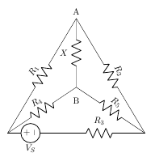
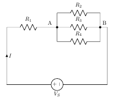
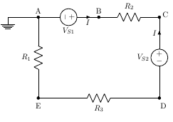

### Assignments

1. A 3 volt battery sends a current of 1 ampere through a light bulb. What is the resistance of the filament of the bulb?
    [Ans:3Ω]

2.  Determine the value of R5 and current through it (IR5), if current through branch AB is zero and R1=1Ω,R2=1.5 Ω,R3=2Ω,R4=4Ω,VS=10 V.
[Ans:R5=6Ω and IR5=0.5 A]

Figure 1  

3. A 50Ω resistor is in parallel with 100Ω resistor. Current in 50Ω resistor is 7.2 A. How will you add a third resistor and what will be its value of the line-current is to be its value if the line-current is to be 12.1 amp ?
[Ans:Third resistance must be connected in parallel with 277Ω]

4. A resistor of 12 Ω is connected in series with a combination of 15 Ω and 20 Ω resistor in parallel. When a voltage of 120 V is applied across the whole circuit find the current taken from the supply.
[Ans:5 A ]

5. Three parallel connected resistors when connected across a d.c. voltage source dissipate a total power of 72 W. The total current drawn is 6 A, the current flowing through the first resistor is 3 A and the second and third resistors have equal value. What are the resistances of the three resistors ?
[Ans:4Ω, 8Ω, 8Ω ]

6. Calculate the voltage drop across the following electrical loads:
    1. The bulb that has 2.4 amperes flowing through it. The resistance of the bulb is 16 ohms.
[Ans:38.4V]

    2. A coffee grinder that has a resistance of 85 ohms and a current of 1.41 amperes flowing through it.
[Ans:119.85V]

     3. A current of 0.024 amperes flowing through a resistance of 750 ohms.
[Ans:18V]

7. A resistance of 10 Ω(R1) is connected in series with two resistances each of 15 Ω(R2 and R3) arranged in parallel. What resistance(R4) must be shunted across this parallel combination so that the total current taken shall be 1.5 A with 20 V applied ?
[Ans:R4=6Ω]

Figure 2  

8. Compute the relative potentials of points A, B, C, D and E which point A is grounded. Calculate the voltage drop across resistance R1? Does it affect the circuit operation or potential difference between any pair of points ?[where, R1=6Ω,R2=2 Ω,R3=4Ω,VS1=34 V,VS2=10 V,I=2 A].
[Ans:V=12 V]

Figure 3  

