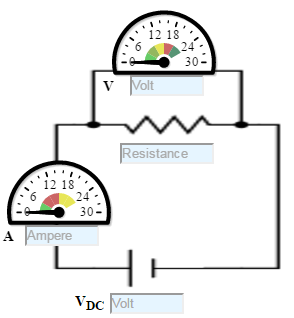
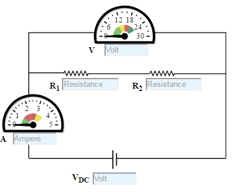
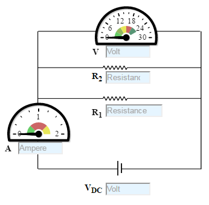
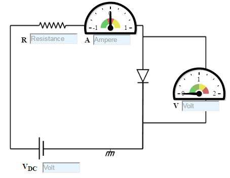

## Procedure
### Experiment

#### Let us go through the experiment of confirming Ohms Law.
1.  Set DC voltage(0-30 V).
2.  Set the Resistance Value(1 Kohm - 100 Kohm) .
3.  Voltmeter is placed parallel to resistor and ammeter series with resistor.
4.  Now note the Voltmeter and Ammeter reading for DC voltage.
5.  Increase the DC voltage by 2 factor and note Voltmeter and Ammeter Readings. Keep resistance value constant
6.  Plot the V-I graph to verify Ohm's Law.
7.  Repeat step 2 to 6 for another set of resistance value.
8. V versus I graph is a straight line.
9. Therefore from the graph we see that the resistance do adhere to Ohm’s law. Thus resistance is said to be an Ohmic device.

Figure:1

#### Let us go through the experiment of confirming Ohms Law with Resistance in series.
1. Set DC voltage(0-30 V).
2. Here resistance are kept in series. Set the resistance R1(1 Kohm - 100 Kohm) value and set resistance R2(5 - 15 Kohm).
3. Voltmeter is placed parallel with resistor and ammeter series with resistor.
4. Now note the Voltmeter and Ammeter reading for DC voltage.
5. Increase the DC voltage by 2 factor and note Voltmeter and Ammeter Readings. Keeping resistance value constant
6. Plot the V-I graph to verify Ohm's Law
7. Repeat step 2 to 6 for another set of resistance value.

Figure: 2

#### Let us go through the experiment of confirming Ohms Law with Resistance in parallel.
- Set DC voltage(0-30 V).
- Here Resistances are kept parallelly. Set the resistance R1 (100 ohm- 2 kohm) value and set resistance R2(1 -30 kohm).
- Voltmeter is placed parallel to resistor and ammeter series with resistor.
- Now note the Voltmeter and Ammeter reading for DC voltage.
- Increase the DC voltage by 2 factor and note Voltmeter and Ammeter Readings. Keeping Resistance value constant
- Plot the V-I graph to verify Ohm's Law.
- Repeat step 2 to 6 for another set of resistance value.

Figure: 3

## Exploratory Experiment

### Let us go through the experiment of confirming Non Ohmic Device.
- Set DC voltage to 5 V .
- Use the resistor of 100K ohms and a diode.
- Voltmeter is placed parallel to Silicon diode and ammeter series with resistor.
- Now note the Voltmeter and Ammeter reading for DC voltage 5V.
- Decrease the Resistance as 75K, 51K, 24K and 10K Ohms and take the readings and note Voltmeter reading across Silicon diode and Ammeter reading.
- Plot the V-I graph and observe the change.
- The Change is not simply proportional. V versus I graph is not a straight line.
- Therefore from the graph we see that the diode does not adhere to Ohms law.Thus diode is said to be non-Ohmic device.

Figure: 4

