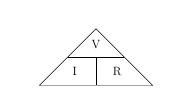
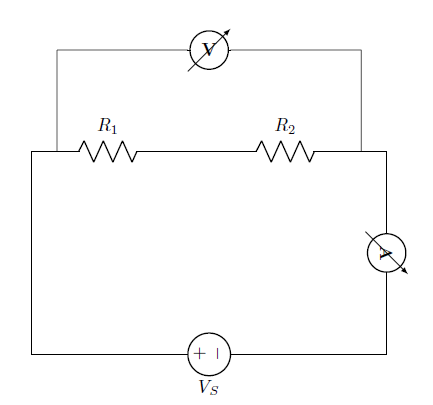
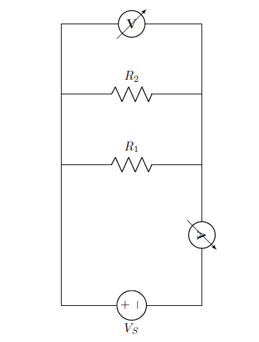
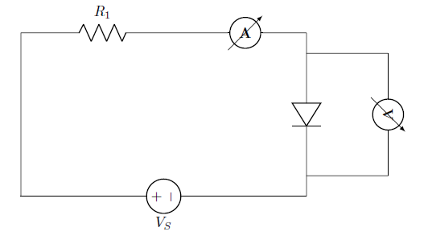

# Theory

## Ohm's Law

The law states that the current through a conductor between two points is directly proportional to the voltage across the two points. Such a conductor is characterized by its ‘Resistance’ – R measured in Ohms.
V=I×R
V is the Voltage in Volts across the conductor.
I is the current in Amperes through the conductor.
Voltage(V) is directly proportional to current i.e V=I×R.
Resistance(R) in inversely proportional to current(I) i.e $$I=\frac{V}{R}$$

Figure 1: Ohm's Law triangle  

### NOTE:

From the above figure, the equation may be represented by a triangle known as Ohm's Law triangle, where V (voltage) is placed on the top section, the I (current) is placed to the left section, and the R (resistance) is placed to the right. The line that divides the left and right sections indicates multiplication, and the divider between the top and bottom sections indicates division.

Therefore equations derived from Ohm's law triangle are-

V=I×R
 
$$I=\frac{V}{R}$$

$$R=\frac{V}{I}$$

### Explaination of Ohm's Law

Figure 2: Current through resistor  

From the circuit:

The voltage across resistor is equal to source voltage:

$$V_R = V_S$$

The current through the resistance is given by:

$$I=\frac{V_R}{R}$$

### Explaination of Ohm's Law for Resistance in series

Series circuits are sometimes called current-coupled or daisy chain-coupled. The current in a series circuit goes through every component in the circuit. Therefore, all of the components in a series connection carry the same current. There is only one path in a series circuit in which the current can flow.

Current:

$$I=I_1=I_2=I_3$$

Resistance:

$$R_{eq}=R-1+R_2+R_3$$

Voltage:

$$V_S=V_{R1}+V_{R2}+V_{R3}$$

Figure 3: Series resistor  

From the circuit:

The equivalent resistance,

$$R_{eq}=R_1+R_2$$

The total current of the circuit,

$$I_T=\frac{V_S}{R_{eq}}$$

Voltage across each resistance are,

For resistance R1,

$$V_{R1}=R_1×I_T$$

For resistance R2,

$$V_{R2}=R_2×I_T$$

In a series circuit, the current through each of the resistors is the same, and the voltage across the circuit is the sum of the voltages across each resistor.

### Explaination of Ohm's Law for Resistance in parallel

If two or more components are connected in parallel they have the same potential difference (voltage) across their ends. The potential differences across the components are the same in magnitude, and they also have identical polarities. The same voltage is applicable to all circuit components connected in parallel. The total current is the sum of the currents through the individual components, in accordance with Kirchhoff’s current law.

Voltage:

$$V=V_1=V_2=V_3$$

Resistance:

$$\frac{1}{R_{eq}}=\frac{1}{R_1}+\frac{1}{R_2}+\frac{1}{R_3}$$

Current:

$$I_T=I_{R1}+I_{R2}+I_{R3}$$

Figure 4: Parallel resistor  

From the circuit:

The equivalent resistance,

$$R_{eq}=\frac{R_1×R_2}{R_1+R_2}$$

The total current of the circuit,

$$I_T=\frac{V_S}{R_{eq}}$$

Current across each resistance are,

For resistance R1,

$$I_{R1}=\frac{V_S}{R_1}$$

For resistance R2,

$$I_{R2}=\frac{V_S}{R_2}$$

In a parallel circuit, the voltage across each of the resistors is the same, and the total current is the sum of the currents through each resistor.

### Explaination of Non Ohmic Device

A Non ohmic device is a device that does not obey Ohm's Law i.e. the resistance is not constant, but changes in a way that depends on the voltage across it.The device is said to be non-Ohmic. In this case V versus I graph is not a straight line, but has some curvy shape. Such devices do not have a constant value of resistance and the resistance is called dynamic resistance because it is constantly changing.Examples of such devices are tungsten filament (bulb), diode,thermistor etc.

Figure 5: Non Ohmic Device  

### Note

- Ohms Law is a very useful law but it only applies to devices that behave like resistors – ie – I is simply proportional to V.
- Ohms Law describes one possible relationship between V and I in a component, but there are others, like
    - Capacitors ( I proportional to rate of change of V )
    - Diodes ( I flows in only 1 direction )
    - Thermistors ( Temperature dependent resistors )

